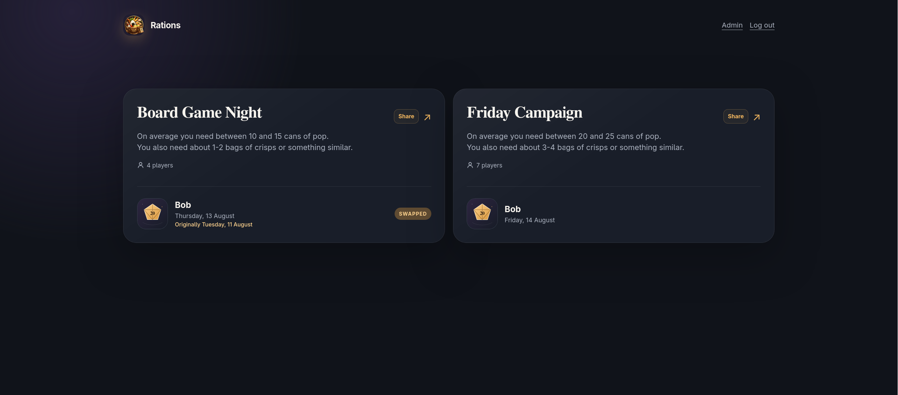
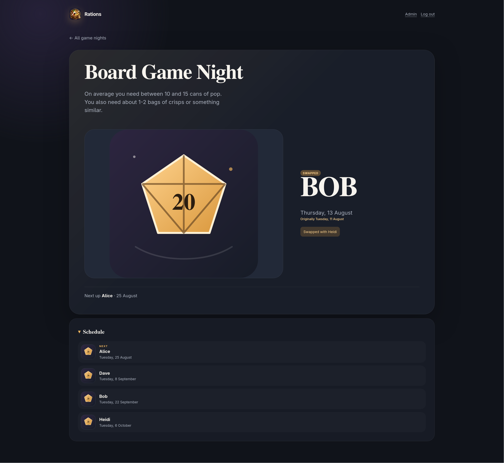
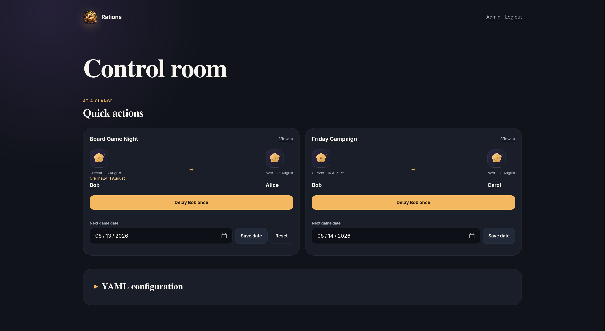

<p align="center">
  
</p>

# Rations

Rations shows who brings snacks to recurring game nights. It is a small, server-rendered Hono application backed by one YAML file—no database and no client-side framework.

## Screenshots

<p align="center">
  
  
  
</p>

## Quick start

Rations ships as a Docker image ([`mastermindzh/rations`](https://hub.docker.com/r/mastermindzh/rations)). Docker is all you need.

1. Generate an admin password hash (swap in your own password):

```sh
docker run --rm mastermindzh/rations node scripts/hash-password.mjs 'your-password'
```

1. Create `data/config.yml` (see [Configuration](#configuration)) and paste the hash into `admin.passwordHash`. Put any portraits in `data/images/`.

2. Run the app:

```sh
docker run -d \
  --name rations \
  --restart unless-stopped \
  -p 3000:3000 \
  -v "$(pwd)/data:/data" \
  -e SESSION_SECRET="$(openssl rand -base64 48)" \
  mastermindzh/rations
```

Then open:

- `http://localhost:3000` - the overview
- `http://localhost:3000/admin/login` - administration
- `http://localhost:3000/health` - health check

## Configuration

All data lives in `data/config.yml` and portraits live in `data/images/`.

```yaml
site:
  title: Rations
  password: overview # Optional; omit or leave empty for public access
  timezone: Europe/Amsterdam

admin:
  passwordHash: scrypt$16384$8$1$...

people:
  alice:
    name: Alice
    image: alice.webp
  bob:
    name: Bob

gameNights:
  - id: board-games
    name: Board Game Night
    password: boardgames # Optional; omit or leave empty for public access
    description: Optional description
    anchorDate: 2026-01-13
    intervalDays: 14
    people:
      - alice
      - bob

overrides: []

dateOverrides:
  - gameNight: board-games
    oldDate: 2026-07-28
    newDate: 2026-07-30
```

- IDs use lowercase slugs such as `gloomhaven`.
- Dates use `YYYY-MM-DD`.
- `intervalDays` controls how often the night repeats.
- The people list defines the snack rotation and player count.
- Descriptions and portrait filenames are optional.
- Portraits may be JPG, PNG, WebP, or AVIF files.
- `dateOverrides` reschedule one occurrence. `oldDate` must be a date from the recurring schedule; `newDate` is the actual replacement date.
- Rescheduled occurrences show their new date and retain an “Originally …” date throughout the site.
- Snack-assignment `overrides` continue to use the scheduled `oldDate` when the same occurrence is also rescheduled.

The admin page contains quick actions for delaying a person or changing the next game date. A rescheduled date can be reset to its recurring scheduled date. The complete YAML editor and game schedule are collapsible. Invalid YAML is never saved.

## Sharing a game night

The overview and every game night have separate share passwords:

```text
/?password=overview
/night/board-games?password=boardgames
```

Administrators bypass all share passwords. Leave the list or game password empty, or omit it, to make that page public. The Share button copies a ready-to-use absolute game URL. These passwords are share tokens stored as plain text in YAML. Do not reuse an account password: URL values may appear in browser history and proxy logs.

## Docker

Everything except the YAML configuration is passed as an environment variable; only `./data` (config and portraits) is mounted. See the [Quick start](#quick-start) for the `docker run` command.

### Generating the admin password hash without Docker

The [Quick start](#quick-start) generates the hash with the image itself. If you would rather not use Docker for it, OpenSSL 3.x produces the same `scrypt` hash (no Node required):

```sh
PW='your-password'
SALT_HEX=$(openssl rand -hex 16)
SALT_B64=$(printf '%b' "$(printf '%s' "$SALT_HEX" | sed 's/../\\x&/g')" | base64 | tr '+/' '-_' | tr -d '=')
KEY_B64=$(openssl kdf -keylen 64 -binary -kdfopt n:16384 -kdfopt r:8 -kdfopt p:1 -kdfopt "pass:$PW" -kdfopt "hexsalt:$SALT_HEX" SCRYPT | base64 | tr '+/' '-_' | tr -d '=')
printf 'scrypt$16384$8$1$%s$%s\n' "$SALT_B64" "$KEY_B64"
```

Copy the resulting `scrypt$16384$8$1$…` line into `admin.passwordHash`.

### Environment variables

| Variable         | Required         | Default              | Purpose                                                                                                                                                                                                                                                        |
| ---------------- | ---------------- | -------------------- | -------------------------------------------------------------------------------------------------------------------------------------------------------------------------------------------------------------------------------------------------------------- |
| `SESSION_SECRET` | Yes (production) | —                    | Signs admin sessions; at least 32 characters. The `docker run` above generates a random value per run, which logs admins out when the container is recreated. Pass a fixed value (`-e SESSION_SECRET="your-fixed-secret"`) to keep sessions across recreation. |
| `PORT`           | No               | `3000`               | HTTP port inside the container. Change the host port with the `-p` mapping (for example `-p 8080:3000`).                                                                                                                                                       |
| `DATA_DIRECTORY` | No               | `/data`              | Configuration and portrait directory.                                                                                                                                                                                                                          |
| `NODE_ENV`       | No               | `production` (image) | Enables secure cookies and production security checks.                                                                                                                                                                                                         |

The schedule timezone comes from `site.timezone` in `config.yml`; no separate `TZ` environment variable is needed.
